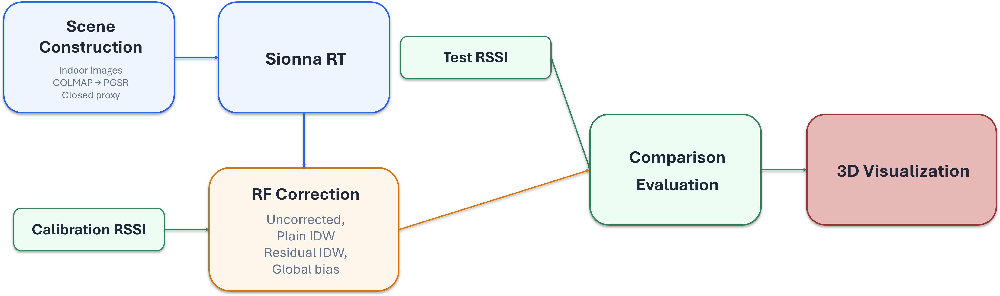
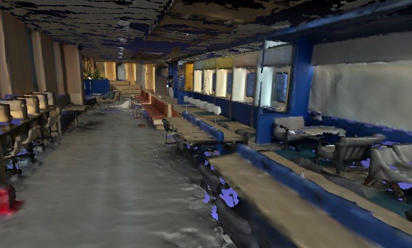
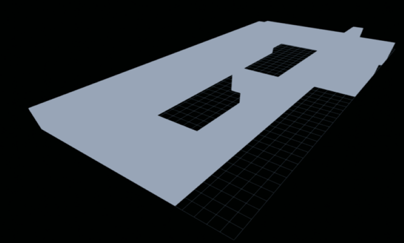
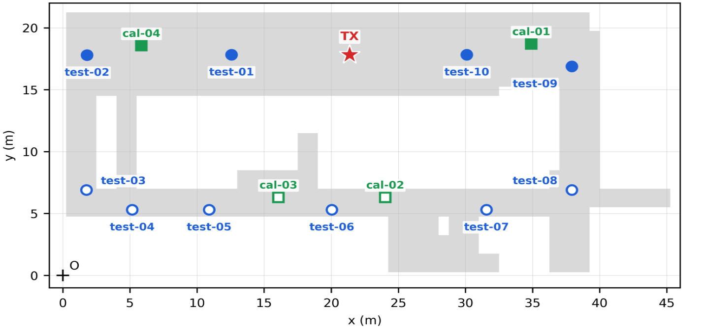
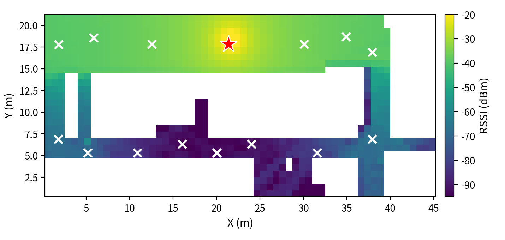
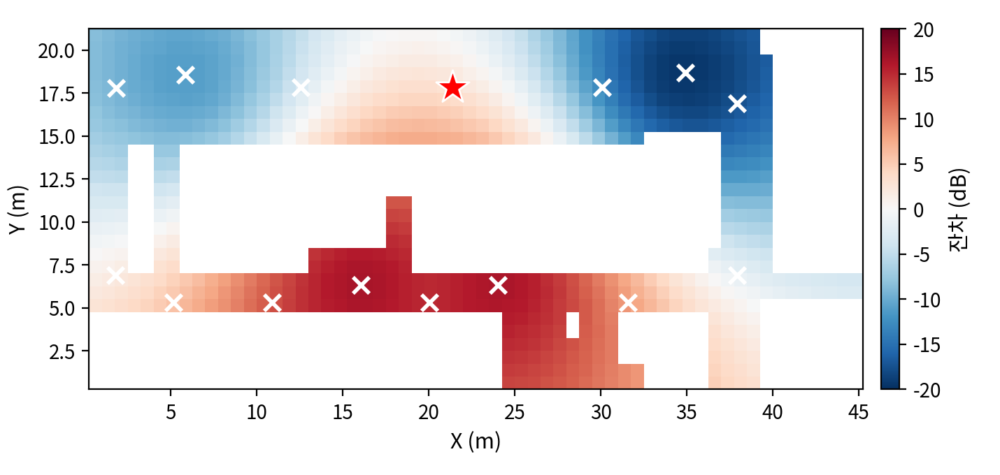
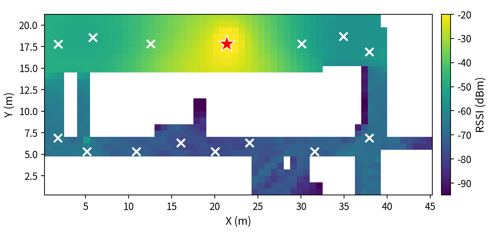
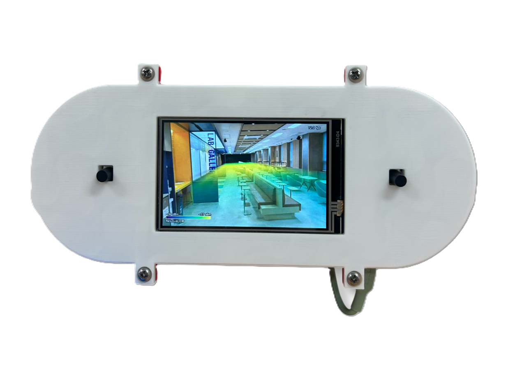

# 사진 기반 실내 복원과 실측 잔차 보정을 결합한 RF 신호장 추정 및 3D 시각화

**영문 제목(안)**: Indoor RF Field Estimation and 3D Visualization by Combining Photogrammetric Reconstruction with Measurement-Based Residual Correction

## Abstract

We estimate an indoor RF field by combining a photogrammetric 3D Gaussian Splatting scene,
triangle-mesh ray tracing, and measured received signal strength indicator (RSSI) values in a
common metric coordinate system. A closed proxy scene derived from PGSR is used for Sionna RT,
while five ESP32 devices (four fixed calibration nodes and one mobile test node) provide the
measurements. We evaluate four estimation approaches using 20 repeated observations collected at
10 test points during forward and reverse passes through a ring-shaped corridor. The mean
absolute error (MAE) is 7.64 dB for uncorrected ray tracing, 5.33 dB for measurement-only inverse
distance weighting, 3.41 dB for residual interpolation, and 8.26 dB for global-bias correction.
The opposite bias signs observed in line-of-sight (-10.1 dB) and non-line-of-sight (+3.4 dB)
regions indicate that a single global offset cannot correct both regions. The residual
interpolation error and the 3.90 dB difference between repeated passes are of similar magnitude,
suggesting that measurement variability is non-negligible. The estimates are also rendered as a
3D RF volume over the reconstructed scene.

**Keywords**: 3D Gaussian Splatting, Sionna RT, RSSI, Residual IDW, Radio Map, Indoor Propagation

## 1. 서론

무선 네트워크의 품질을 분석할 때 수신 신호 세기 지표(Received Signal Strength Indicator, RSSI)는 접근이 쉽고 위치별 비교가 가능하다는 장점이 있다. 그러나 RSSI는 송신기와 수신기 사이의 거리만으로 결정되지 않는다. 직접 경로의 차폐, 벽과 바닥의 반사, 수신기의 높이와 방향, 사람의 이동과 주변 무선 간섭이 측정값에 영향을 준다. 따라서 단순 거리 모델이나 소수 측정점의 보간만으로는 공간 구조에 따른 급격한 변화를 설명하기 어렵다.

기존 RSSI 시각화는 주로 평면 도면 위에 측정값을 보간한 2차원 히트맵을 활용한다. 이 방식은 신호가 강하거나 약한 위치를 빠르게 파악하는 데 유용하지만, 실제 공간의 벽과 물체를 함께 보면서 신호 변화를 해석하기 어렵다. 실내 공간을 수작업 CAD 모델로 구축하는 방법도 가능하지만 구축 비용이 높고 공간이 달라질 때마다 작업을 반복해야 한다.

3D Gaussian Splatting(3DGS)은 다중 시점 영상으로부터 사실적인 장면을 재구성하고 새로운 시점을 빠르게 렌더링할 수 있어[1], 실제 공간의 모습과 무선 신호 분포를 결합하는 시각적 기반으로 적합하다. 그러나 3DGS의 반투명 Gaussian 집합은 전파가 어느 표면에 충돌하고 반사되는지를 결정하는 명시적 경계를 제공하지 않는다. 또한 광선 추적은 공간 기하를 반영할 수 있지만 실제 재질의 유전율과 전도도, 송신 전력, 안테나 특성, 장치별 수신 감도를 정확히 알기 어렵다. 반대로 측정값만 보간하면 실측되지 않은 위치의 벽과 차폐 구조를 반영하기 어렵다. 따라서 공간 구조를 반영한 시뮬레이션과 소수의 실측을 결합하는 방법이 필요하다.

본 연구는 모델 편향이 공간에 따라 달라지는지를 확인하기 위해 전역 편향 보정과 공간 잔차 보정을 비교한다. 전역 편향 보정은 보정점 잔차의 평균을 모든 위치에 적용하고, 공간 잔차 보정은 위치별 잔차를 보간한다. 이를 위해 사진 기반 3DGS 장면에서 닫힌 전파 계산용 프록시 장면을 구성하고, 시각 장면·Sionna RT·다중 장치 실측을 하나의 미터 좌표계와 공통 데이터 규약으로 연결하였다. 링 복도의 10개 지점에서 정·역으로 수집한 20개 반복 관측치를 이용해 네 가지 결합 방법을 비교하고, LoS와 NLoS에서 나타난 잔차 특성을 분석하였다. 추정 결과는 재구성 장면 위에 3차원 RF 볼륨으로 시각화하였다.

## 2. 관련 연구

### 2.1 3D Gaussian Splatting과 표면 복원

3DGS는 다중 시점 영상으로부터 Gaussian 장면을 학습하여 새로운 시점을 빠르게 렌더링한다[1]. 2DGS[2], SuGaR[3]와 PGSR[4]은 Gaussian을 표면에 더 가깝게 정렬하여 기하 복원을 개선한다. 본 연구는 시각화에는 PGSR의 Gaussian을 사용하되, 전파 계산에는 메시의 구멍과 부유 기하를 정리한 닫힌 프록시 장면을 사용한다.

### 2.2 광선 추적 기반 전파 시뮬레이션

Sionna RT는 삼각형 메시와 전파 재질을 이용해 직접파, 반사, 회절과 산란을 포함한 경로 및 전파 지도를 계산한다[5,6]. 본 연구는 재질을 실측으로 학습하지 않고 시뮬레이션과 측정의 차이를 공간적으로 보간한다.

### 2.3 측정 기반 RSSI 추정과 신경 RF 모델링

RADAR[7] 이후 RSSI 라디오 맵은 실내 측위와 공간 추정에 널리 사용되었고[8,9], IDW[10]와 가우시안 프로세스[11]도 측정값의 공간 보간에 활용되었다. 본 연구는 보정 지점이 네 개뿐인 조건에서 별도 학습이 필요 없는 IDW를 비교 기준으로 사용하며, 잔차 IDW는 측정값 자체가 아니라 시뮬레이션과 측정의 차이만 보간한다. 한편 NeRF2[12], WiNeRT[13]와 WRF-GS[14]는 신경 표현으로 무선 채널이나 방사장을 학습한다. 이와 달리 본 연구는 환경별 측정 데이터로 신경장을 학습하지 않고, 명시적 기하 기반 예측에 네 지점의 실측 잔차를 결합한다.

### 2.4 3차원 RF 시각화와 현장 인터페이스

실내 라디오 맵은 위치별 수신 전력이나 채널 정보를 공간 위에 표현하며, 최근에는 2차원 평면을 넘어 3차원 장면과 결합하는 방향으로 확장되고 있다. Suga 등은 RGB-D 영상으로 벽과 장애물의 3차원 정보를 구성하고 이를 레이 트레이싱에 입력하여 실내 라디오 맵을 생성하였다[15]. Zhang 등은 서로 다른 높이에서 생성한 2차원 라디오 환경 지도를 쌓아 임의 높이와 주파수에 대응하는 3차원 지도를 구성하였다[16]. NeRF2는 무선 신호 전파를 연속적인 볼륨 함수로 표현하며[12], WRF-GS는 3D Gaussian을 이용해 무선 방사장을 재구성하고 전파 특성을 시각화한다[14].

이들 연구는 라디오 맵 생성이나 채널 예측에 초점을 둔다. 본 연구는 시각화용 PGSR 장면과 전파 계산용 프록시 장면을 분리하고, Sionna RT의 예측 수신 전력에 ESP32 실측 잔차를 결합하여 여러 높이의 3차원 RF 볼륨을 생성한다. 또한 이 볼륨을 3DGS 뷰어에 표시하고 IMU와 버튼을 갖춘 핸드헬드 인터페이스로 탐색할 수 있도록 구성한다.

## 3. 제안 방법

### 3.1 문제 정의

시각화용 Gaussian 장면, 전파 계산용 표면 장면과 RF 볼륨은 하나의 미터 좌표계에 배치한다. 위치 $x$에서 Sionna RT가 계산한 선형 경로 이득을 $G(x)$, 설정한 송신 전력을 $P_{TX}$ dBm이라 하면 예측 수신 전력은 $\hat{R}_S(x)=P_{TX}+10\log_{10}G(x)$이다. ESP32가 측정한 RSSI를 $R(x)$라 할 때 보정 위치 $x_i$의 잔차는 다음과 같다.

$$
e_i=R(x_i)-\hat{R}_S(x_i). \qquad (1)
$$

이 잔차에는 기하 및 재질 모델의 오차, 실제 안테나와 등방성 안테나 모델의 차이, 장치 편차와 시간에 따른 환경 변화가 함께 포함된다. 본 데이터만으로 각 원인을 분리할 수 없으며, 잔차가 위치에 따라 달라지는지만 비교한다. 시험 지점의 측정값은 잔차 보간, IDW 지수, 재질과 송신 전력 선정에는 사용하지 않았다.

### 3.2 전체 파이프라인

**Fig. 1.** Overall structure of the proposed pipeline.

Fig. 1의 파이프라인은 장면 구축, 계측, 전파 계산, 측정 보정, 비교 평가와 3차원 시각화로 구성된다. PGSR 장면과 닫힌 프록시를 같은 미터 좌표에 배치하고, Sionna RT의 예측 수신 전력과 다섯 ESP32의 RSSI를 지점별로 비교한다. 보정 지점의 잔차를 결합한 격자는 3차원 RF 볼륨으로 변환되어 렌더러에 표시된다.

### 3.3 PGSR 장면과 프록시 장면 생성

다중 시점 영상으로 COLMAP 카메라 자세와 PGSR 장면을 생성한다. PGSR 메시와 실측 구조를 참고해 바닥, 천장, 벽과 주요 차폐물이 닫힌 표면을 이루도록 프록시를 구성한다. 두 장면의 관계는 Fig. 2와 같다.

(a) PGSR surface mesh

(b) Closed proxy shell

**Fig. 2.** Scene layers used in this work. (a) PGSR surface mesh and (b) the closed proxy shell derived from it.

원본 Gaussian, PGSR 메시와 프록시는 별도 계층으로 보존한다.

### 3.4 Sionna RT 전파 계산

프록시 장면에는 Sionna 전파 재질을 지정한다. 2.437 GHz에서 가시선, 정반사, 회절과 확산 산란을 활성화하고 벽 투과는 제외한다. 최대 상호작용 깊이 `max_depth`는 예측값이 수렴하는 12로 설정하였으며, 16과 20으로 높였을 때의 추가 변화는 1 dB 이내였다. 지점 계산은 보정 및 시험 지점의 예측 수신 전력을 생성하고, 격자 계산은 측정 높이 평면의 공간 분포를 생성한다. 두 계산은 20 dBm 송신 전력과 단일 등방성 및 수직 편파 안테나를 가정하고 $10\log_{10}G$ 변환을 사용한다.

### 3.5 RSSI 계측과 네트워크 수집

네 원격 ESP32는 고정 채널에서 목표 AP의 RSSI를 측정하고, 이동평균으로 필터링한 값을 ESP-NOW로 게이트웨이에 전달한다[17]. 전송 데이터에는 장치 식별자, 패킷 순번, 원시·필터링 RSSI, 필터 표본 수와 오류 상태가 포함되며, CRC로 패킷 손상을 검사한다. 게이트웨이는 수신 패킷을 검증하고 자체 RSSI 측정값을 더해 UART로 STM32에 전달한다. STM32가 장치별 최신 상태를 구성하면 직렬-MQTT 브리지가 이를 정규화하여 장치별 MQTT 메시지로 발행한다[18].

백엔드는 장치 식별자, RSSI, 패킷 순번, 오류 상태와 위치 정보를 검사하고 서버 수신 시각을 함께 저장한다. 비정상 표본은 삭제하지 않고 제외 사유와 함께 원시 데이터에 남기되, 대표값 계산과 잔차 보정에서는 제외한다. 패킷 순번은 중복과 누락을 확인하는 데 사용하며, 기록 구간은 서버 수신 시각을 기준으로 시험 지점별 시간창에 배정한다. 수집 단계가 약한 신호를 먼저 제거하지 않도록 유효 RSSI 하한은 모든 계층에서 -110 dBm으로 통일하였다.

장치별 편차는 실험 전 다섯 장치를 같은 위치에 두고 동시에 측정하여 산출한다. 장치 $k$의 RSSI를 최근 유효 표본의 이동평균으로 필터링한 뒤 그 중앙값을 $m_k$, 다섯 $m_k$의 중앙값을 $\bar{m}$이라 하자. 장치 $k$의 편차 보정값은 $\bar{m}-m_k$이며, 보정된 측정값은 원 측정값에 이 값을 더해 얻는다. 특정 장치 하나가 아니라 전체 중앙값을 기준으로 사용하여 기준 장치의 이상치 영향을 줄인다.

### 3.6 실측값과 시뮬레이션의 결합

보정 위치를 $x_i$라 할 때 IDW 가중치는 식 (2)와 같다. 지수 $p=2$는 평가 전에 고정했고, $\epsilon=10^{-12}$는 0으로 나눗셈을 방지하는 상수다. 질의 위치가 보정 위치와 일치하면 해당 표본을 직접 사용한다.

$$
w_i(x)=\frac{1}{\lVert x-x_i\rVert_2^p+\epsilon}. \qquad (2)
$$

보정 RSSI를 $R_i=R(x_i)$라 할 때 비교하는 네 방법은 다음과 같다. **원시 예측**(uncorrected prediction)은 실측 보정 없이 $\hat{R}_S(x)$를 그대로 사용한다. **일반 IDW**(plain IDW)는 $R_i$를 식 (2)의 가중치로 평균한다. **잔차 IDW**(residual IDW)는 식 (1)의 $e_i$를 보간하여 시뮬레이션 예측에 더한다(식 (3)). **전역 편향 보정**(global-bias correction)은 같은 잔차의 산술평균을 모든 예측에 더한다(식 (4)).

$$
\hat{R}_{hybrid}(x)=\hat{R}_S(x)+\frac{\sum_i w_i(x)e_i}{\sum_i w_i(x)}. \qquad (3)
$$

$$
\hat{R}_{global}(x)=\hat{R}_S(x)+\frac{1}{N}\sum_{i=1}^{N}e_i. \qquad (4)
$$

여기서 $N$은 보정 지점 수다. 네 방법은 같은 보정/시험 분할과 좌표를 사용한다.

고정 보정 장치의 측정값도 시간에 따라 변하므로, 특정 시험 지점의 예측을 보정할 때 사용하는 $e_i$는 그 시험 지점의 기록 시간창과 동일한 창에서 관측된 보정 지점 측정값으로 계산한다. 시간창은 백엔드 서버 수신 시각을 기준으로 정의하므로, 다섯 장치 사이의 시계 동기 없이도 같은 구간의 표본을 묶을 수 있다. 실행 전체 평균을 모든 시험 지점에 공통 적용하지 않으며, 정방향과 역방향은 서로 다른 실행으로 유지한다.

### 3.7 3차원 RF 볼륨과 시각화

방법별 예측을 여러 높이의 격자로 다시 계산해 0.25 m에서 2.75 m까지 여섯 높이의 3차원 RF 볼륨으로 묶는다. 각 높이의 격자는 같은 XY 해상도를 공유하며, 전파 계산이 실패했거나 정의되지 않은 위치는 유효성 마스크로 구분한다.

렌더러는 이 볼륨을 3차원 텍스처로 불러와 광선 행진(ray marching)으로 알파 합성한다. 프록시 메시의 깊이보다 먼 샘플은 제거하여 벽 뒤 신호의 표시를 제한하며, 세 방법을 같은 시점에서 전환할 수 있다.

다만 실측 잔차는 측정이 이루어진 단일 높이에서만 존재하므로 다른 높이의 잔차 보정값은 수직 외삽값이다. 따라서 RF 볼륨의 수직 변화는 정성적 시각화로 한정하고, 정량 평가는 실측 높이 평면에서만 수행한다.

### 3.8 핸드헬드 인터페이스와 영상 전송

핸드헬드는 ESP32-S3, BNO085 IMU, 800×480 LCD와 두 개의 물리 버튼으로 구성된다. 3DGS 렌더링과 RF 볼륨 합성은 PC에서 수행하고, 핸드헬드는 자세와 버튼 상태를 전송하면서 완성된 렌더링 영상을 수신해 표시한다. 이 구조는 임베디드 장치에서 장면을 다시 계산하지 않고도 PC의 시각화 결과를 현장에서 탐색할 수 있도록 한다.

BNO085의 쿼터니언과 디바운스된 버튼 상태는 50 Hz UDP 패킷으로 백엔드에 전달되고, 백엔드는 유효한 최신 상태를 WebSocket으로 렌더러에 중계한다. 렌더러는 연결 시점의 기기 자세를 기준으로 삼아 이후의 상대 자세 변화로 카메라를 회전시킨다. 텔레포트 버튼을 누르는 동안에는 현재 시선 방향의 이동 후보를 표시하고 버튼을 놓을 때 이동하며, 높이 순환 버튼의 누름 변화가 감지될 때마다 RF 볼륨의 표시 높이를 다음 단계로 전환한다. IMU는 방향 입력에만 사용하며 절대 위치를 추정하지 않는다.

렌더러는 800×480 프레임을 생성해 RGB332와 zlib을 결합한 형식으로 전송하며, JPEG 경로도 단일 이미지 확인과 호환을 위해 유지한다. 각 프레임에는 순번, 생성 시각과 페이로드 길이를 포함한 공통 헤더를 붙인다. 네트워크 중계기는 프레임을 다시 인코딩하지 않고 전달하며, 수신이 늦을 때는 오래된 프레임보다 최신 완성 프레임을 우선한다. 핸드헬드는 수신 데이터를 해제한 뒤 LCD에 출력한다.

## 4. 실험 및 결과

### 4.1 실험 설계

실험 공간은 중앙 코어를 둘러싼 링 형태의 복도로, 넓은 개방 복도와 좁은 복도가 코어를 사이에 두고 마주 본다. 이 배치는 코어 뒤편에 깊은 비가시선 영역을 만들면서도 링을 따라 우회하는 경로를 함께 제공하므로 결합 방식의 차이를 드러내기에 적합하다.

보정 지점은 가시선 2개와 비가시선 2개를 고루 포함하도록 배치하였다. 보정 집합이 한쪽 구간에만 있으면 반대 구간의 보정이 외삽이 되기 때문이다. 상세 조건은 Table 1, 지점 배치는 Fig. 3에 제시한다.

**Table 1.** Experimental configuration.

| Item | Setting |
| --- | --- |
| Transmitter | ipTIME N602SR ×1, 2.437 GHz (channel 6), height 0.80 m |
| Receivers | 5 ESP32 (4 fixed calibration + 1 mobile test), height 0.45 m |
| Simulation setup | 20 dBm transmit power, single isotropic antenna, vertical polarization, concrete preset (not measured) |
| Propagation effects | LoS, specular reflection, diffraction, diffuse scattering; wall transmission excluded; `max_depth=12` |
| Calibration / test points | 4 fixed (2 LoS + 2 NLoS) / 10 mobile (4 LoS + 6 NLoS) |
| Measurement procedure | Forward test-01→test-10, reverse test-10→test-01 (separate runs); 20 s settling + 120 s recording per point |
| Representative value | Median of the moving average of recent valid RSSI samples + per-run device offset correction |

**Fig. 3.** Coordinate system of the ring corridor with the transmitter, four calibration points, and ten test points.

### 4.2 평가 지표

시험 지점의 실측값과 예측값 사이의 MAE와 RMSE를 계산한다. 추가로 가시선/비가시선 구간별 오차를 보고한다. 또한 동일 지점을 두 방향에서 측정한 값의 차이를 반복 측정 차이로 정의하고, 이를 측정 자체의 변동 규모로 보아 알고리즘 오차와 비교한다.

### 4.3 방법별 예측 정확도

잔차 IDW는 비교한 네 방법 중 오차가 가장 낮았다. 10개 지점에서 정·역으로 수집한 20개 반복 관측치의 기술통계는 Table 2와 같다. 잔차 IDW의 MAE는 이 표본에서 일반 IDW 대비 36.0%, 원시 예측 대비 55.4% 낮았다. 개별 관측 기준으로는 20개 중 15개에서 원시 예측보다 오차가 작았다. 보정 전 Sionna RT의 공간 예측 결과는 Fig. 4와 같다.

**Table 2.** Prediction error for 20 repeated observations at 10 test points.

| Method | MAE (dB) | RMSE (dB) |
| --- | --- | --- |
| Uncorrected prediction | 7.64 | 9.32 |
| Plain IDW | 5.33 | 7.09 |
| **Residual IDW** | **3.41** | **4.74** |
| Global-bias correction | 8.26 | 9.83 |

**Fig. 4.** Spatial distribution of received power predicted by uncorrected Sionna RT.

정방향 측정에서 cal-04의 RSSI 변동 범위는 12 dB였으며, 이를 고려해 시험 지점과 동일한 시간창의 보정값을 사용하였다.

정·역방향 측정값의 차이는 MAE 3.90 dB로, 잔차 IDW의 예측 오차 3.41 dB와 비슷한 규모였다. 이는 예측 오차에 반복 측정 변동의 영향도 포함될 수 있음을 시사한다.

### 4.4 공간적 예측 편향 분석

LoS와 NLoS에서 편향 방향이 반대로 나타났으며, 본 표본에서 전역 보정은 원시 예측의 오차를 줄이지 못했다(Table 2, 3).

**Table 3.** Prediction bias and per-method MAE by region.

| Region | n | Mean Bias (dB) | Uncorrected MAE (dB) | Plain IDW MAE (dB) | Residual IDW MAE (dB) |
| --- | --- | --- | --- | --- | --- |
| Line-of-sight (LoS) | 8 | **-10.1** | 10.03 | 7.84 | **2.41** |
| Non-line-of-sight (NLoS) | 12 | **+3.4** | 6.05 | **3.66** | 4.05 |

식 (1)의 잔차를 공간적으로 보간한 결과는 Fig. 5와 같다. 잔차는 실측 RSSI에서 Sionna RT의 예측 수신 전력을 뺀 값이므로, 양수는 실측값이 예측값보다 큰 영역을 뜻한다.

**Fig. 5.** Spatial residual field interpolated from the differences between measured RSSI and Sionna RT predicted received power.

잔차 IDW는 LoS에서 가장 크게 개선됐지만, NLoS에서는 일반 IDW보다 오차가 컸다. 특히 test-07에서는 인접 보정점의 잔차가 보간되면서 원시 예측보다 오차가 증가했다. 이는 잔차가 모든 위치에서 매끄럽게 변하지 않을 가능성을 시사한다. 잔차 IDW로 생성한 복도 RF 지도는 Fig. 6과 같다.

**Fig. 6.** Corridor RF map generated by residual IDW.

### 4.5 시스템 기능 검증

구현한 시각화 시스템의 기능은 실제 ESP32-S3 핸드헬드와 렌더러를 연결한 상태에서 확인하였다. 렌더링 영상이 핸드헬드 디스플레이에 출력되었고, 실제 장착 상태의 IMU 자세 변화에 따라 카메라가 회전하였다. 또한 텔레포트 버튼을 사용해 지정한 위치로 이동할 수 있었으며, 높이 순환 버튼을 누를 때 표시되는 RF 볼륨의 높이가 순차적으로 전환되었다.

**Fig. 7.** Prototype ESP32-S3 handheld device used for system verification.

## 5. 결론 및 향후 연구

본 논문은 사진 기반 3DGS 장면, Sionna RT와 ESP32 RSSI 측정을 결합하고, 시뮬레이션과 실측의 잔차를 공간적으로 보간하는 방법을 제안하였다. 단일 링 복도 실험에서 잔차 IDW는 비교한 네 방법 중 가장 낮은 MAE 3.41 dB를 보였다. 또한 LoS와 NLoS의 편향 방향이 달라 모든 위치에 같은 보정값을 적용하는 방식에는 한계가 있음을 확인하였다.

다만 본 평가는 한 건물의 한 개 층, 단일 송신기와 채널, 네 개 보정 지점에 한정된 기술통계이다. 시뮬레이션에는 명목값과 이상화된 안테나·재질 모델을 사용하였다. 본 평가는 RSSI 기반 수신 세기 비교에 한정되며, 정밀 채널 특성은 측정하지 않았다. 잔차의 개별 물리적 원인과 반복 측정 변동의 영향도 분리하지 않았다.

잔차 IDW는 test-07처럼 원시 예측이 정확한 위치의 오차를 키울 수 있으며, 다른 높이에 적용한 RF 볼륨은 정성적 시각화에 한정된다. 향후에는 다양한 공간, 시간, 높이에서 보정 지점 배치와 NLoS 잔차를 평가하고, 시각화 시스템의 지속 프레임률 및 지연·손실을 정량화할 예정이다.

## REFERENCE

[1] B. Kerbl, G. Kopanas, T. Leimkühler, and G. Drettakis, "3D Gaussian Splatting for Real-Time Radiance Field Rendering," *ACM Transactions on Graphics*, Vol. 42, No. 4, Article 139, 2023.
[2] B. Huang, Z. Yu, A. Chen, A. Geiger, and S. Gao, "2D Gaussian Splatting for Geometrically Accurate Radiance Fields," *Proceedings of the ACM SIGGRAPH 2024 Conference Papers*, Article 32, 2024.
[3] A. Guedon and V. Lepetit, "SuGaR: Surface-Aligned Gaussian Splatting for Efficient 3D Mesh Reconstruction and High-Quality Mesh Rendering," *Proceedings of the IEEE/CVF Conference on Computer Vision and Pattern Recognition*, pp. 5354-5363, 2024.
[4] D. Chen, H. Li, W. Ye, Y. Wang, W. Xie, S. Zhai, et al., "PGSR: Planar-Based Gaussian Splatting for Efficient and High-Fidelity Surface Reconstruction," *arXiv Preprint*, arXiv:2406.06521, 2024.
[5] F. Ait Aoudia, J. Hoydis, M. Nimier-David, S. Cammerer, and A. Keller, "Sionna RT: Technical Report," *arXiv Preprint*, arXiv:2504.21719, 2025.
[6] J. Hoydis, F. Ait Aoudia, S. Cammerer, M. Nimier-David, N. Binder, G. Marcus, et al., "Sionna RT: Differentiable Ray Tracing for Radio Propagation Modeling," *arXiv Preprint*, arXiv:2303.11103, 2023.
[7] P. Bahl and V.N. Padmanabhan, "RADAR: An In-Building RF-Based User Location and Tracking System," *Proceedings of the IEEE International Conference on Computer Communications*, pp. 775-784, 2000.
[8] J. Park, J. Lee, and S. Kim, "Performance Improvement Algorithm for Wireless Localization Based on RSSI at Indoor Environment," *The Journal of Korean Institute of Communications and Information Sciences*, Vol. 36, No. 4C, pp. 254-264, 2011.
[9] H. Noh, Y. Oh, N. Lee, and W. Shin, "A Survey of Deep Learning-Assisted Indoor Localization with Wi-Fi Fingerprinting: Current Status and Research Challenges," *The Journal of Korean Institute of Communications and Information Sciences*, Vol. 46, No. 5, pp. 848-862, 2021, DOI: 10.7840/kics.2021.46.5.848.
[10] D. Shepard, "A Two-Dimensional Interpolation Function for Irregularly-Spaced Data," *Proceedings of the 23rd ACM National Conference*, pp. 517-524, 1968.
[11] B. Ferris, D. Hahnel, and D. Fox, "Gaussian Processes for Signal Strength-Based Location Estimation," *Proceedings of Robotics: Science and Systems*, 2006.
[12] X. Zhao, Z. An, Q. Pan, and L. Yang, "NeRF2: Neural Radio-Frequency Radiance Fields," *Proceedings of the 29th Annual International Conference on Mobile Computing and Networking*, pp. 393-407, 2023.
[13] T. Orekondy, P. Kumar, S. Kadambi, H. Ye, J. Soriaga, and A. Behboodi, "WiNeRT: Towards Neural Ray Tracing for Wireless Channel Modelling and Differentiable Simulations," *Proceedings of the International Conference on Learning Representations*, 2023.
[14] C. Wen, J. Tong, Y. Hu, Z. Lin, and J. Zhang, "Neural Representation for Wireless Radiation Field Reconstruction: A 3D Gaussian Splatting Approach," *IEEE Transactions on Wireless Communications*, Vol. 25, pp. 7490-7504, 2026, DOI: 10.1109/TWC.2025.3631663.
[15] N. Suga, Y. Maeda, and K. Sato, "Indoor Radio Map Construction via Ray Tracing With RGB-D Sensor-Based 3D Reconstruction: Concept and Experiments in WLAN Systems," *IEEE Access*, Vol. 11, pp. 24863-24874, 2023, DOI: 10.1109/ACCESS.2023.3254912.
[16] S. Zhang, Z. Li, H. Li, Y. Zha, H. Wang, Z. Shen, et al., "Novel Radio Environment Map Construction Scheme for 3-D and Full Band for Modern Internet of Things Applications," *IEEE Internet of Things Journal*, Vol. 12, No. 9, pp. 12419-12432, 2025, DOI: 10.1109/JIOT.2024.3520611.
[17] Espressif Systems, "ESP-NOW SDK: ESP32 API Reference." [Online]. Available: https://docs.espressif.com/projects/esp-now/en/latest/esp32/api-reference/index.html (accessed September 11, 2026).
[18] OASIS Open, "MQTT Version 5.0," *OASIS Standard*, March 2019. [Online]. Available: https://docs.oasis-open.org/mqtt/mqtt/v5.0/mqtt-v5.0.html (accessed September 11, 2026).
