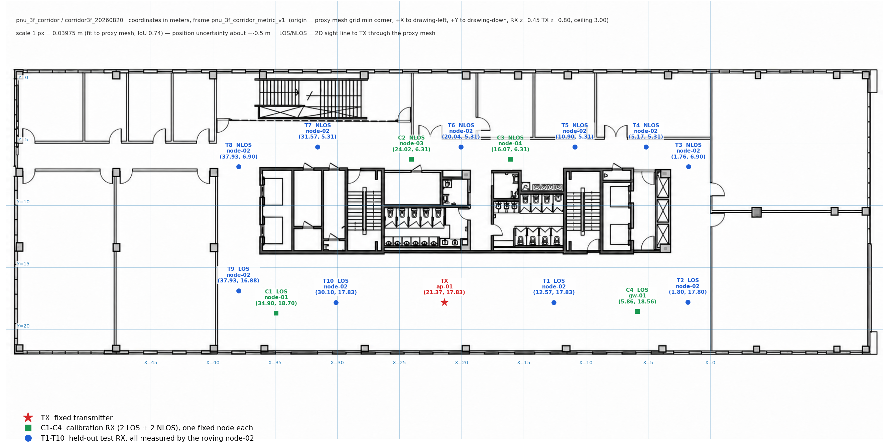
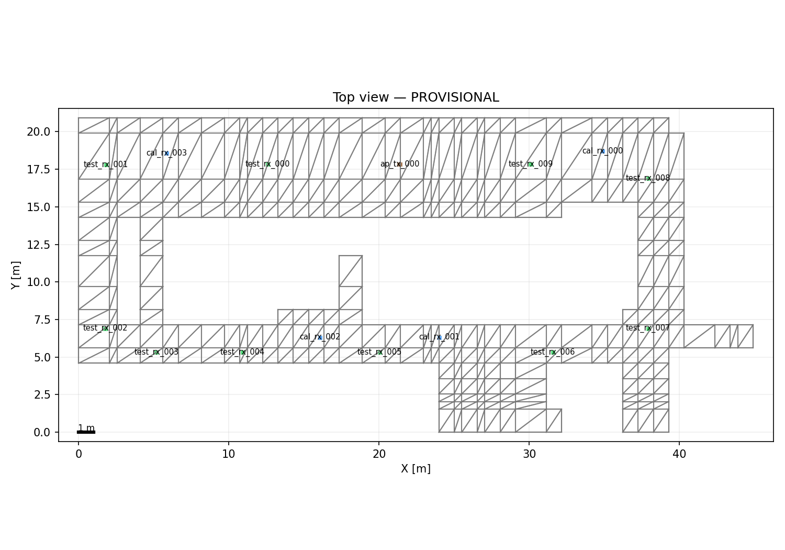

# 부산대 3층 복도 최종 RF 실험 계획

- 실험 ID: `corridor3f_20260820`
- 대상 Scene: `pnu_3f_corridor`
- 좌표계: `pnu_3f_corridor_metric_v1`
- 문서 기준일: 2026-08-21
- 한 줄 결론: **TX 1대, 고정 Calibration RX 4대, 이동 Test RX 1대로 10개 위치를 정·역방향 측정한다.** 좌표 배치는 확정했지만 도면 기반 좌표이므로 실제 위치 오차는 약 ±0.5 m로 본다.

## 1. 현재 상태

| 구분 | 상태 | 의미 |
| --- | --- | --- |
| COLMAP / PGSR / 복도 Proxy Mesh | 완료 | 3층 복도 Scene과 복도 외곽 형상을 생성했다. |
| TX / Calibration / Test 좌표 | **배치 확정** | Marker 계약은 `ready`; 15개 표식의 실내 여부와 간격 검증을 통과했다. |
| 미터 배율 | 임시 확정 | 층고 3.0 m 하나로 계산했다. 도면 정합 IoU 0.74, 위치 불확실성 약 ±0.5 m이다. |
| 세부 장애물·전파 재질 | **미확정** | 문·계단·금속문 등의 최종 배치와 재질 실측이 남아 Scene 계약은 `draft`다. |
| 실제 RF 측정 | 예정 | 정방향과 역방향을 서로 다른 Run으로 수행한다. |

측정 전에 가능하면 넓은 복도의 벽-벽 거리 또는 T1–T10 거리처럼 **긴 수평 길이 하나**를 추가로 잰다. 이 값이 없더라도 측정은 진행할 수 있지만, 좌표는 측량값이 아니라 도면 기반 계획값으로 보고해야 한다.

## 2. 실험 목적

1. ㅁ자 복도의 LOS와 NLOS 구간을 모두 포함해 실제 RSSI를 수집한다.
2. C1–C4만 보정에 사용하고, T1–T10은 학습·보정에 넣지 않은 독립 Test로 평가한다.
3. 동일한 Test 구간에서 Raw Sionna, Plain IDW, Residual IDW의 MAE와 RMSE를 비교한다.
4. 정방향과 역방향 결과를 비교해 시간 변화와 반복성을 확인한다.

## 3. 배치도

### 3.1 설계도 기준 좌표

- 빨간 별: 고정 TX `ap-01`
- 초록 사각형: 고정 Calibration RX C1–C4
- 파란 원: 이동 Test RX T1–T10
- 도면의 LOS/NLOS 표기는 TX까지의 Proxy Mesh상 2D 가시선 판정이다.

### 3.2 Proxy Mesh 기준 배치

이 그림은 좌표와 Proxy Mesh가 겹치는지 확인하기 위한 **provisional top view**다. 실제 RSSI 정확도나 세부 장애물까지 검증됐다는 뜻은 아니다.

## 4. 좌표계와 높이

| 항목 | 값 |
| --- | --- |
| 단위 | m, 오른손 좌표계, 위쪽 `+Z` |
| 원점 | Proxy Mesh 점유 격자의 최소 모서리, 바닥 `z=0` |
| `+X` | 도면에서 왼쪽, 계단실 방향 |
| `+Y` | 도면에서 아래쪽, 좁은 복도에서 넓은 복도 방향 |
| RX 안테나 중심 높이 | 0.45 m |
| TX 안테나 중심 높이 | 0.80 m |
| 층고 | 3.00 m |
| 도면 배율 | 1 px = 0.03975 m |
| 좌표 불확실성 | 약 ±0.5 m |

현장에서는 수학적 원점을 찾으려 하지 말고, 위 배치도의 벽·모서리·복도 중앙선을 기준으로 놓는다.

## 5. TX / RX 배치 계약

| 표식 | point_id | 장치 | 역할 | X | Y | Z | LOS/NLOS | 위치 |
| --- | --- | --- | --- | ---: | ---: | ---: | --- | --- |
| TX | — | `ap-01` | transmitter | 21.37 | 17.83 | 0.80 | — | 넓은 복도 중앙 |
| C1 | `cal-01` | `node-01` | calibration | 34.90 | 18.70 | 0.45 | LOS | 넓은 복도 왼쪽 |
| C2 | `cal-02` | `node-03` | calibration | 24.02 | 6.31 | 0.45 | NLOS | 좁은 복도 중앙 |
| C3 | `cal-03` | `node-04` | calibration | 16.07 | 6.31 | 0.45 | NLOS | 좁은 복도 코어 통로 부근 |
| C4 | `cal-04` | `gw-01` | calibration | 5.86 | 18.56 | 0.45 | LOS | 넓은 복도 오른쪽 |
| T1 | `test-01` | `node-02` | test | 12.57 | 17.83 | 0.45 | LOS | 넓은 복도 |
| T2 | `test-02` | `node-02` | test | 1.80 | 17.80 | 0.45 | LOS | 넓은 복도 오른쪽 끝 |
| T3 | `test-03` | `node-02` | test | 1.76 | 6.90 | 0.45 | NLOS | 오른쪽 짧은 복도 |
| T4 | `test-04` | `node-02` | test | 5.17 | 5.31 | 0.45 | NLOS | 좁은 복도 |
| T5 | `test-05` | `node-02` | test | 10.90 | 5.31 | 0.45 | NLOS | 좁은 복도 |
| T6 | `test-06` | `node-02` | test | 20.04 | 5.31 | 0.45 | NLOS | 좁은 복도 |
| T7 | `test-07` | `node-02` | test | 31.57 | 5.31 | 0.45 | NLOS | 좁은 복도 |
| T8 | `test-08` | `node-02` | test | 37.93 | 6.90 | 0.45 | NLOS | 왼쪽 짧은 복도 |
| T9 | `test-09` | `node-02` | test | 37.93 | 16.88 | 0.45 | LOS | 넓은 복도 왼쪽 끝 |
| T10 | `test-10` | `node-02` | test | 30.10 | 17.83 | 0.45 | LOS | 넓은 복도 |

배치 구성은 Calibration **LOS 2 + NLOS 2**, Test **LOS 4 + NLOS 6**이다. Calibration과 Test 사이의 최소 거리는 3.53 m라 Test 독립성 기준 3 m를 만족한다.

TX의 2.4 GHz와 20 dBm은 명목 설정값이며, 계측기로 검증한 송신 전력은 아니다.

## 6. 현장 측정 절차

### 6.1 시작 전 Offset 측정

1. RX 5대(`node-01`–`node-04`, `gw-01`)를 같은 위치에 둔다.
2. 같은 TX를 보게 한 상태로 5분간 기록한다.
3. 이 값을 **pre-offset**으로 저장하고 본 실험 보정에 사용한다.

### 6.2 정방향 Run

1. TX와 C1–C4를 표의 위치에 고정하고 Run을 시작한다.
2. C1–C4는 Run이 끝날 때까지 계속 기록한다.
3. `node-02`를 T1 → T10 순서로 이동한다.
4. 각 위치에서 20초간 안정화한 뒤 120초간 TestSegment를 기록한다.
5. 위치를 옮기는 동안의 `node-02` 데이터는 Test 결과에 넣지 않는다.

### 6.3 역방향 Run

새 `run_id`로 별도 Run을 만들고 T10 → T1 순서로 같은 절차를 반복한다. 정방향과 역방향 데이터를 한 Run으로 합치지 않는다.

### 6.4 종료 후 Offset 측정

RX 5대를 다시 같은 위치에 모아 5분간 기록한다. **post-offset은 드리프트 확인용 QC**이며 pre-offset 값을 덮어쓰지 않는다.

10개 Test는 과하지 않다. 한 방향의 순수 안정화·기록 시간은 23분 20초이고, 이동 시간을 더하면 약 30분이다. ㅁ자 복도의 네 변과 LOS/NLOS를 고르게 평가하려면 현재 10개를 유지하는 편이 낫다.

## 7. 데이터 사용 규칙

- 유효 Test 구간은 `[recording_started_at_ms, recording_ended_at_ms)`이며 Backend의 `server_ts_ms`로 구간을 판정한다.
- 각 Test는 **같은 `segment_id`와 같은 2분 시간대의 C1–C4**와 비교한다.
- C1–C4의 전체 Run 평균 하나를 모든 Test에 공통 적용하지 않는다.
- T1–T10은 평가 전용이다. IDW나 bias fitting에 Test RSSI를 넣지 않는다.
- 각 행에 `run_id`, `segment_id`, `point_id`, `node_id`, 역할, 좌표, `BSSID`, 채널이 남아야 한다.
- 현장에서 위치를 바꿨으면 계획 좌표가 아니라 **실제 사용 좌표와 변경 이유**를 기록한다.

## 8. 약한 NLOS 지점 처리

C2와 C3은 Sionna 예측이 약 -105 dBm이라 실제 장치에서 수신이 끊길 수 있다. 배치 직후 이 두 곳부터 확인한다.

- 30초 이상 한 프레임도 수신하지 못하면 아래 예비 좌표로 이동한다.
- Test T5–T7의 미수신은 결과로 남길 수 있지만, Calibration C2/C3 미수신은 보정을 할 수 없으므로 반드시 조치한다.

| 대상 | 예비 좌표 (X, Y, Z) | 사용 조건 |
| --- | --- | --- |
| C2 | (34.40, 6.60, 0.45) | C2 계획 위치 미수신 |
| C3 | (8.10, 6.60, 0.45) | C3 계획 위치 미수신 |
| 공통 추가 후보 | (37.40, 1.38, 0.45) | 두 지점 모두 실패했을 때 |

예비 좌표를 사용하면 도면, `tx_rx.json`, Backend 좌표를 모두 같은 값으로 갱신한다.

## 9. 현장 종료 전 체크리스트

- [ ] pre-offset 5분과 post-offset 5분을 모두 저장했다.
- [ ] 정방향 10개, 역방향 10개 TestSegment가 서로 다른 `run_id`에 있다.
- [ ] 각 TestSegment에 이동 Test 1대와 고정 Calibration 4대 데이터가 모두 있다.
- [ ] 첫 Segment 직후 좌표·역할·`node_id`가 Export에 기록되는지 확인했다.
- [ ] 위치 변경, 문 상태, 사람 통행, 장치 재부팅 등 현장 변수를 기록했다.
- [ ] SQLite/원본 로그, Export CSV, `qc_report.json`을 두 곳 이상에 백업했다.

## 10. 완료 판정과 산출물

다음을 모두 만족해야 측정 완료로 판정한다.

1. Test 10개 × 정·역방향 2회가 모두 존재한다.
2. 각 Test의 같은 시간 창에 C1–C4가 모두 존재한다.
3. 좌표, 역할, 장치 ID, BSSID, 채널 누락이 없다.
4. pre/post offset과 QC 결과가 보존됐다.
5. Raw Sionna, Plain IDW, Residual IDW의 동일 Test 기준 MAE/RMSE와 heatmap을 생성했다.

이 조건을 만족해도 세부 장애물·재질 실측과 반복성 검토가 끝나기 전에는 “실험 완료”와 “최종 논문용 검증 완료”를 같은 의미로 쓰지 않는다.

## 11. 원본 계약 위치

- 실험 설명: `RFVisualizer/scenes/pnu_3f_corridor/experiments/corridor3f_20260820/README.md`
- 좌표 계약: `RFVisualizer/scenes/pnu_3f_corridor/experiments/corridor3f_20260820/configs/tx_rx.json`
- Scene 계약: `RFVisualizer/scenes/pnu_3f_corridor/experiments/corridor3f_20260820/configs/scene.json`
- 분석 방법: `RFVisualizer/scenes/pnu_3f_corridor/experiments/corridor3f_20260820/configs/method_config.json`
- Backend 측정 계약: `RFVisualizer-Docs/network/NETWORK.md`

좌표가 바뀌면 이 문서보다 먼저 `tx_rx.json`과 현장 Export 좌표를 수정하고, 배치도와 본 문서를 함께 갱신한다.
